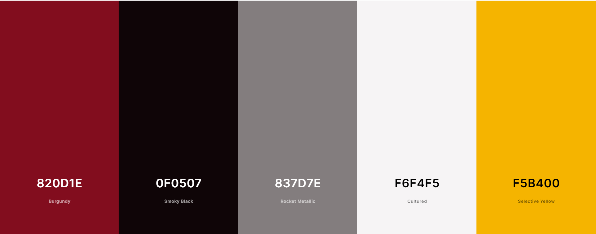
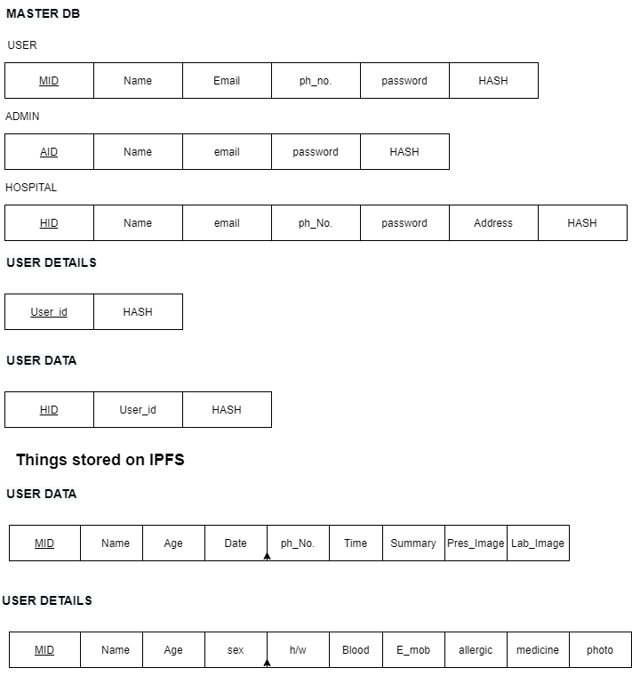

# Cognitio
“No record gets lost, that is the objective.

## Electronic Health Record

##### Electronic Health card , with storing data with the use of decentralise blockcahin and using ML/DL to process the data.
##### A Decentralised storage where user medical health history will be kept saved and can be used later in future.

##### Color Pallet

#### LOGO

#### Interfaces 

User Application - Flutter based
Hospital Application - Web App
Emergency usage  - Web app

#### SCHEMA

##### Data will be stored on top of ethereum on IPFS , Just like nft are saved all files and record will be saved .

## PPT

